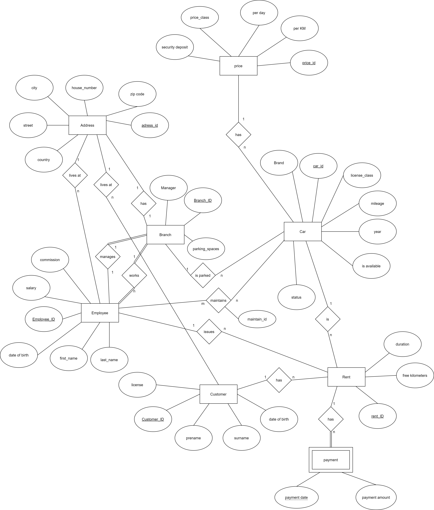

<p align="center">


</p>

# Usage 

This Application is dockerized, simply start the container using:
```bash
docker-compose up
```
The App is now up and running under ```localhost:5000```.


# Introduction

Car2Rent is an application made for car rental services. It comes with a dashboard based on [ChartJS](https://www.google.com) and several basic CRUD functionalities. Supported actions are:
- adding customers, cars, rents
- removing or hiding cars
- modifying/update (active) rents, e.g. add more time
- Listing all customers, (available) cars, rents


The application is based on the powerful, open source DBMS, [Postgres](https://www.postgresql.org/). The backend was implemented using pythons [Flask](https://flask.palletsprojects.com/en/2.0.x/) webframework. The Flask<>database communication is enabled through [psycopg](https://www.psycopg.org/), a PostgreSQL driver for python, and [sqlalchemy](https://www.sqlalchemy.org/).

**Note:** This Application is not intended for production deployment and thus isn't secured against injection attacks.


# Database 
## Specification

- Every car is tracked and categorized by a unique id, several attributes such as "brand" & "mileage" and a boolean attribute "is_available". If the car is already rented, is_available will be 0 otherwise 1.

- Customers are stored with an id, first and last name, license and address. A customer must have a license. The attribute "license_id" contains the class, allowed to drive.

- Employees are stored with an id, several personal information, the branch they work at and the commission they get. An Employee can manage a branch and issue the rentals. Every car return must be overseen by an employee, this is managed by the table "maintains".

- Every Branch is supervised by a manager. A car can be rented from any branch. If a car is rented, the free parking space in that branch is increased. 

- A customer can only rent one car at a time. Mileage_returned is at first null and upon return updated. Every car that is rented must be issued by an employee.
- The price a customer has to pay is derived from the price of the car. Every car has a price per day and a price per kilometer.

- Prices are usually per day. If a fix amount of free kilometers is exceeded then an additional price is due. (Every car has a fix insurance price.)

- After the rental is returned, the employee has to maintain the car, e.g. clean it and note down any possible damages.

- A rent can have multiple payments, mostly one upon renting and one upon return if the free mileage got exceeded. Then the customer has to pay additional fees upon return.

- Customers, Employees and Branches have addresses that are tracked separately. This is useful because it ensures that every address follows the same format/structure.
<br><br>
## ER-Model
<br>


<br>

## Relational-Model


## Database design explanation

### Normalization

According to Codd, a table is in 3NF if and only if:
 1. The relation is in second normal form
 2. Every non-prime attribute of relation R is non-transitively dependent on every key of R

To ensure at least 2NF, the addresses are kept in separate tables and are refered to via a Foreign Key. The payments were split from the rents and are now maintained in a separate table, so that every payment is only dependent on the Primary Key of the table payment. Prices are stored in a separate table as well.

Every non-prime attribute is non-transitively dependent on every PK of the resepective table. This was achieved by splitting the table in such a way that every attribute can only be uniquely identified by the PK. In the table "Price" the attribute price_class shouldn't be confused with an identifier and is to be seen as a name for the row. Because it might be possible to have another instance with the same value for price_class, e.g. in case of a special offer (a new row with the same price_class but different prices per day), there is no transitive dependency between that attribute and other attributes of the table.
 
 Furthermore, during the design of the database, attributes were chosen in such a way that every attribute is atomic and redundancies were removed by splitting the tables and adding new relations (e.g. addresses). 
 Although some guidelines suggest that adding data type prefixes isn't recommended, I decided to include them for convenience during the coding process. 
 When handling queries in Flask, it's easier to directly know what datatype is to be expected instead of going back and forth between the python code and the database dump file to cross check.